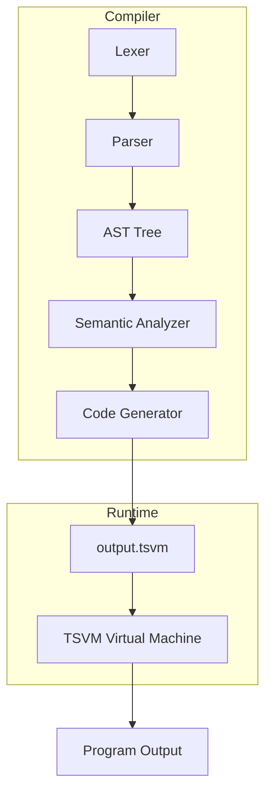

# NITLang — Educational Programming Language & Virtual Machine

NITLang is a small educational programming language developed as part of the *Programming Language Design* course.  
It evolves step-by-step from arithmetic expressions to recursion, scoping, references, types, objects, lambdas, and a virtual machine backend.

---

# 📁 Project Structure
```
AST.py
Tokenizer.py
Parser.py
SemanticAnalysis.py
CodeGenerator.py
tsvm.py
test.txt
README.md
```

---

# 🧠 Compiler Architecture (Mermaid Diagram)

```mermaid
flowchart LR
    A[Source Code (.txt)] --> B[Lexer<br>Tokenizer.py]
    B --> C[Parser<br>Parser.py]
    C --> D[AST Tree<br>AST.py]
    D --> E[Semantic Analyzer<br>SemanticAnalysis.py]
    E --> F[Code Generator<br>CodeGenerator.py]
    F --> G[TSVM Assembly<br>output.tsvm]
    G --> H[Virtual Machine Execution<br>tsvm.py]
```

---

# 1. Abstract Syntax Tree (AST)

All node types that define the structure of NITLang programs are implemented in  
`AST.py`.

Includes node classes for:

- Program, Functions, Classes
- Binary / Unary operations
- Assignments, Variables
- If / While / Block statements
- Vectors, Indexing
- Object creation, Methods, Field access
- Lambda nodes

---

# 2. Tokenizer (Lexer)

Implemented in `Tokenizer.py` using PLY.

Supports:

- Keywords: `let`, `func`, `class`, `if`, `while`, `ref`, `lambda`, `map`, …
- Operators: `+ - * / == != <= >= := -> && ||`
- Literals: integers, strings, booleans, multi-line strings
- Comments: single-line and nested

---

# 3. Parser (Grammar & Syntax)

Implemented in `Parser.py`.

Builds the AST using PLY YACC.  
The parser handles:

- Expressions
- Conditionals / Loops
- Functions & recursion
- Types
- Classes & objects
- Lambdas
- Vectors

---

# 🏛 Semantic Analysis

Implemented in `SemanticAnalysis.py`.

Checks:

- Type correctness  
- Scope (global, local, params)
- Object field rules (private, must use `this`)
- Lambda typing
- Reference rules (`ref`, `:=`)

---

# ⚙ Code Generator

Implemented in `CodeGenerator.py`.

Produces stack-based TSVM assembly.  
Handles:

- Arithmetic, logic, comparisons
- Stack frames & calling conventions
- Methods & constructors
- Object layout (field offsets)
- Vectors & indexing
- References
- Memory allocation

---

# 🖥 TSVM Virtual Machine

Implemented in `tsvm.py`.

Supports:

- Registers (`r0`, `r1`, …, `fp`, `sp`)
- Stack (0–9000), Globals (10000+), Heap (20000+)
- Instructions:  
  `mov`, `ld`, `st`, `add`, `sub`, `mul`, `div`,  
  `cmp`, `push`, `pop`, `br`, `bz`, `bnz`, `call`, `ret`

---

# ▶ How to Run

## 1️⃣ Install dependencies
```
pip install ply
```

## 2️⃣ Compile a NITLang program
```
python Parser.py test.txt
```

Output:  
✔ Semantic validation  
✔ Generated assembly → `output.tsvm`

## 3️⃣ Run on the Virtual Machine
```
python tsvm.py output.tsvm
```

---

# 🚀 Full Pipeline (Mermaid Diagram)



---

# 📌 Example Program (test.txt)

Covers all features:

- Arithmetic  
- Recursion (`fact`)  
- Scope  
- References  
- Types  
- Classes & methods  
- Lambdas & map  

---

# 📜 License
Educational use only (Programming Language Design course).

---

# ✅ Author Notes
This README is auto-generated and formatted for GitHub,  
including Mermaid diagrams for visual clarity.
